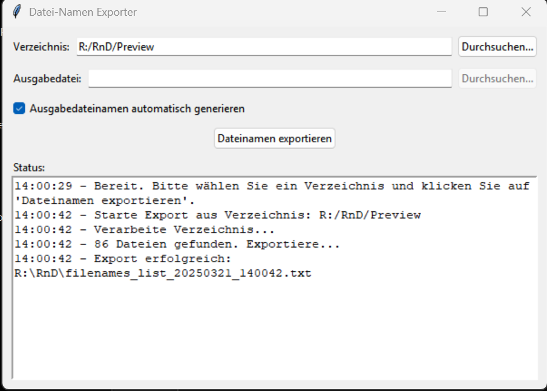
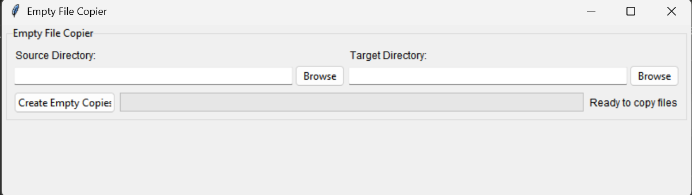

# Python File Utilities

A collection of simple yet useful file management utilities built with Python and Tkinter. These tools provide a user-friendly GUI for common file operations.

## Included Utilities

### 1. File Lister (`util_FileLister`)

Quickly generate a formatted text file containing all filenames from a selected directory.

**Features:**
- Browse for source directory or use the application directory as default
- Auto-generate output filename with timestamp or specify custom output location
- Detailed status reporting
- Automatically open the generated file when complete

### 2. Empty File Copier (`util_EmptyFileCopy`)

Create empty copies of all files from a source directory while preserving filenames.

**Features:**
- Select source and target directories via browse buttons
- Progress tracking during file creation
- Status updates as files are created
- Compact and responsive UI

## Getting Started

### Prerequisites

- Python 3.x
- No additional packages required (uses standard library only)

### Installation

1. Clone this repository or download the ZIP file
2. Extract the files to your desired location
3. Run either utility by double-clicking the corresponding .bat file:
   - `util_FileLister.bat` for the File Lister utility
   - `util_EmptyFileCopy.bat` for the Empty File Copier utility

## Usage Examples

### File Lister

1. Launch `util_FileLister.bat`
2. Select a directory containing the files you want to list
3. Choose whether to auto-generate the output filename or specify a custom one
4. Click "Dateinamen exportieren" (Export Filenames)
5. When complete, you can open the generated text file directly from the success dialog

### Empty File Copier

1. Launch `util_EmptyFileCopy.bat`
2. Select the source directory containing the files you want to copy (only names will be copied)
3. Select the target directory where empty files will be created
4. Click "Create Empty Copies"
5. The utility will create an empty (0 byte) file for each file in the source directory

## Why Use These Utilities?

- **File Lister**: Great for documentation, inventory, or comparing directory contents without needing to view file contents
- **Empty File Copier**: Useful for creating placeholders, templates, or preparing a directory structure

## Notes

- Both utilities are self-contained and use only Python standard library components
- The batch files (.bat) automatically check for Python installation
- Error handling is included for common scenarios

## License

This project is licensed under the MIT License - see the LICENSE file for details.

## Acknowledgments

- Built with Python and Tkinter
- Designed for simplicity and ease of use
